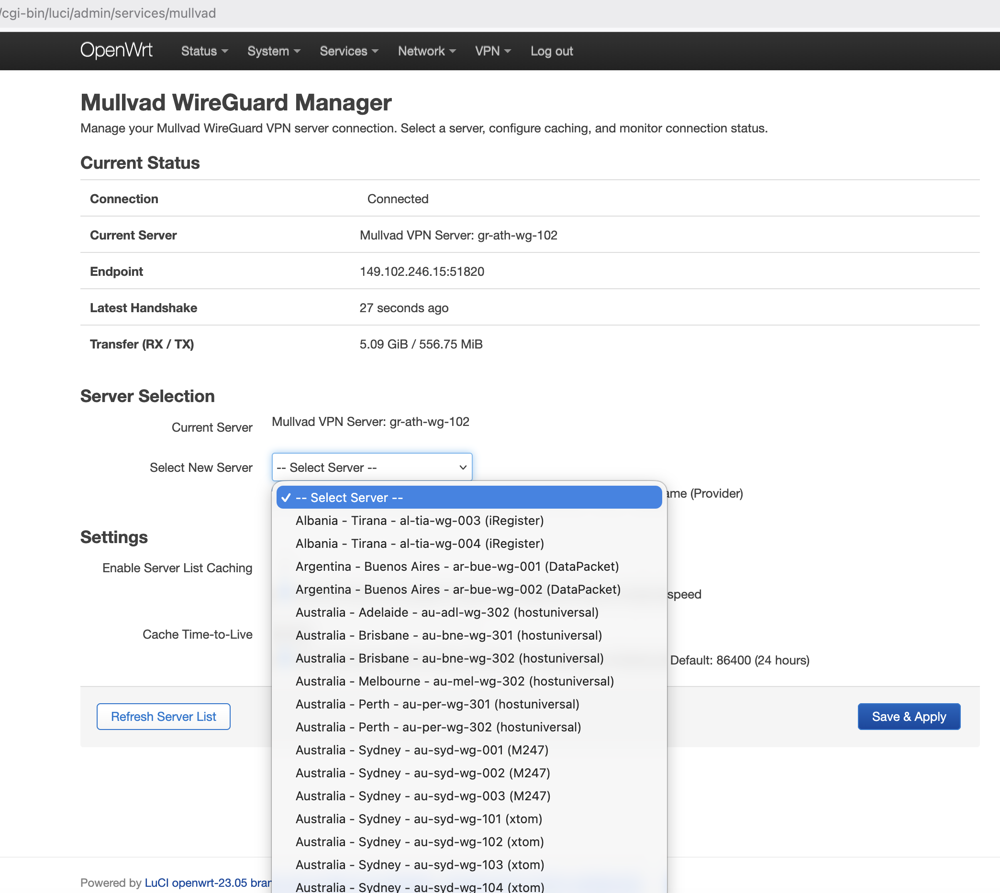

# LuCI Mullvad WireGuard Manager

A LuCI web application for OpenWrt that provides a user-friendly interface to manage Mullvad WireGuard VPN server selection and monitor connection status.



## 📦 Installation

### Download Pre-built Package

**[Download the latest release](https://github.com/linakis/luci-app-mullvad/releases/latest)** - Ready-to-install IPK package for all OpenWrt routers.

### Quick Installation

Install dependencies and the package on your router:

```bash
# Install dependencies
opkg update
opkg install luci-base luci-proto-wireguard wireguard-tools curl jsonfilter

# Download and install the package
cd /tmp
wget https://github.com/linakis/luci-app-mullvad/releases/latest/download/luci-app-mullvad_1.0.0_all.ipk
opkg install luci-app-mullvad_1.0.0_all.ipk

# Restart services
/etc/init.d/rpcd restart && /etc/init.d/uhttpd restart
```

Then access the application at **Services → Mullvad WireGuard** in your router's LuCI interface.

## Features

- **Server Selection**: Browse and select from all available Mullvad WireGuard servers
- **Connection Status**: Real-time display of connection status, handshake time, and transfer statistics
- **Server List Caching**: Optional local caching with configurable TTL to reduce API calls
- **Manual Refresh**: Update server list on-demand from Mullvad's API
- **Safe Configuration**: Changes are staged and require explicit confirmation before applying
- **Status Monitoring**: Shows current endpoint, last handshake, and data transfer metrics
- **Auto-Detection**: Automatically detects your WireGuard interface name on first run

## Prerequisites

### Required Packages
- `luci-base`
- `luci-proto-wireguard`
- `wireguard-tools`
- `curl`
- `jsonfilter`

### Existing WireGuard Configuration
This app assumes you already have a working Mullvad WireGuard configuration in `/etc/config/network` with:
- A WireGuard interface (the app will auto-detect it, or defaults to `MullvadWG`)
- An associated peer section
- Your Mullvad account's private key configured

The app will update the peer's public key and endpoint when switching servers.

### Setting Up Mullvad WireGuard (If Not Already Configured)

If you haven't set up Mullvad WireGuard on OpenWrt yet, follow the official guides:

**Official Mullvad Guides:**
- [WireGuard on a Router](https://mullvad.net/en/help/running-wireguard-router/) - Complete WireGuard setup for routers including OpenWrt
- [OpenWrt Routers and Mullvad VPN](https://mullvad.net/en/help/openwrt-routers-and-mullvad-vpn) - General OpenWrt guide (OpenVPN-focused but has useful background)

**Quick Setup Summary:**
1. Install packages: `luci-proto-wireguard`, `wireguard-tools`
2. Generate WireGuard keys: `wg genkey | tee privatekey | wg pubkey > publickey`
3. Get your Mullvad IP address from the API with your account number and public key
4. Configure the WireGuard interface in LuCI (Network → Interfaces)
5. Install this app to easily manage server selection

## Advanced Installation

### Manual Installation (Development/Testing)

This method works without downloading packages. All files are scripts and configs that work as-is.

1. **Copy files to your router**:
```bash
scp -r luci-app-mullvad root@<router-ip>:/root/
```

2. **SSH into your router**:
```bash
ssh root@<router-ip>
```

3. **Install the application** (on the router):
```bash
cd /root/luci-app-mullvad
cp -r root/* /
cp -r htdocs/* /www/

# Make scripts executable
chmod +x /usr/bin/mullvad-fetch-servers.sh
chmod +x /usr/bin/mullvad-apply-server.sh
chmod +x /usr/bin/mullvad-get-status.sh

# Fix file permissions
chmod 644 /usr/share/rpcd/acl.d/luci-app-mullvad.json
chmod 644 /usr/share/luci/menu.d/luci-app-mullvad.json
chmod 644 /etc/config/mullvad
chmod 644 /www/luci-static/resources/view/mullvad/manager.js

# Fix directory permissions
chmod 755 /www/luci-static/resources/view/mullvad
```

4. **Initialize configuration** (on the router):
```bash
uci commit mullvad
```

5. **Restart services** (on the router):
```bash
/etc/init.d/rpcd restart
/etc/init.d/uhttpd restart
```

6. **Verify installation** (optional):
```bash
# Check that scripts are executable
ls -la /usr/bin/mullvad-*.sh

# Check that all files have correct permissions
ls -la /usr/share/rpcd/acl.d/luci-app-mullvad.json
ls -la /usr/share/luci/menu.d/luci-app-mullvad.json
ls -la /etc/config/mullvad
ls -la /www/luci-static/resources/view/mullvad/manager.js

# Test the fetch script
/usr/bin/mullvad-fetch-servers.sh
```

7. **Access the application**:
   - Navigate to your router's LuCI interface (e.g., http://10.0.0.1)
   - Go to **Services → Mullvad WireGuard**

## Usage

### Accessing the Interface

1. Open your router's LuCI web interface
2. Navigate to **Services → Mullvad WireGuard**

### Switching Servers

1. **View Current Status**: The status section shows your current connection state
2. **Refresh Server List** (optional): Click "Refresh Server List" to get the latest servers from Mullvad
3. **Select Server**: Choose a server from the dropdown list
   - Servers are displayed in the format: **Country - City - Hostname (Provider)**
   - The list is sorted alphabetically by country, then city, then hostname
   - Mullvad-owned servers are labeled as "(Mullvad Owned)"
4. **Apply Server**: Click "Apply Selected Server" to switch to the new server
5. **Confirm Change**: A confirmation dialog will show the server details before applying
6. **Verify Connection**: Status will update within 30 seconds showing the new server

### Configuration Options

#### Cache Settings
- **Enable Caching**: Store server list locally to reduce API calls
- **Cache TTL**: Set how long cached data remains valid (default: 24 hours)
- **WireGuard Interface**: Specify which interface to manage (auto-detected, or defaults to `MullvadWG`)

## Configuration for Different Interface Names

The app automatically detects your WireGuard interface on first run. However, if you need to manually configure it:

### Auto-Detection (Recommended)

The app will automatically detect your WireGuard interface by:
1. Looking for interfaces with `proto=wireguard` in `/etc/config/network`
2. Checking for an associated peer section following the pattern `wireguard_<InterfaceName>`
3. Saving the detected interface name to `/etc/config/mullvad` for future use

No manual configuration needed in most cases!

### Manual Configuration

If auto-detection doesn't work or you want to specify a different interface:

1. **Check your current WireGuard interface name:**
   ```bash
   wg show  # Shows all WireGuard interfaces
   uci show network | grep "proto='wireguard'"  # Shows UCI config
   ```

2. **Set the interface name manually:**
   ```bash
   uci set mullvad.config.wireguard_interface='YOUR_INTERFACE_NAME'
   uci commit mullvad
   ```

3. **Restart LuCI:**
   ```bash
   /etc/init.d/uhttpd restart
   ```

### Examples

For an interface named `wg0`:
```bash
uci set mullvad.config.wireguard_interface='wg0'
uci commit mullvad
```

For the Mullvad guide's recommended name `WGINTERFACE`:
```bash
uci set mullvad.config.wireguard_interface='WGINTERFACE'
uci commit mullvad
```

## Backend Scripts

### mullvad-fetch-servers.sh
Fetches the server list from Mullvad's API (`https://api.mullvad.net/app/v1/relays`) and caches it locally.

**Usage**:
```bash
/usr/bin/mullvad-fetch-servers.sh
```

**Output**: `/tmp/mullvad_servers.json`

### mullvad-apply-server.sh
Updates the WireGuard peer configuration with a new server's details.

**Usage**:
```bash
/usr/bin/mullvad-apply-server.sh <hostname> <public_key> <endpoint_ip> <endpoint_port>
```

**Example**:
```bash
/usr/bin/mullvad-apply-server.sh gr-ath-wg-102 "server_public_key" "185.213.154.68" "51820"
```

### mullvad-get-status.sh
Retrieves current WireGuard connection status and formats it as JSON.

**Usage**:
```bash
/usr/bin/mullvad-get-status.sh
```

**Output**: JSON with connection status, endpoint, handshake time, and transfer statistics

## Configuration

### UCI Configuration File: `/etc/config/mullvad`

```
config settings 'config'
    option cache_enabled '1'                   # Enable/disable caching
    option cache_ttl '86400'                   # Cache TTL in seconds (24 hours)
    option auto_refresh_enabled '0'            # Reserved for future use
    option wireguard_interface 'MullvadWG'     # WireGuard interface name
    option last_fetch '0'                      # Timestamp of last API fetch

config cache 'servers'
    option data ''                             # Cached server list (JSON)
    option timestamp '0'                       # Cache timestamp
```

### Network Configuration Changes

When you switch servers, the app updates `/etc/config/network`:

**Before**:
```
config wireguard_MullvadWG
    option description 'se-sto-wg-101'
    option public_key 'old_server_public_key'
    option endpoint_host '185.65.134.66'
    option endpoint_port '51820'
```

**After**:
```
config wireguard_MullvadWG
    option description 'gr-ath-wg-102'
    option public_key 'new_server_public_key'
    option endpoint_host '185.213.154.68'
    option endpoint_port '51820'
```

## Troubleshooting

### Server list won't load
1. Check internet connectivity: `ping api.mullvad.net`
2. Verify curl is installed: `opkg list-installed | grep curl`
3. Manually test API: `/usr/bin/mullvad-fetch-servers.sh`
4. Check logs: `logread | grep mullvad`

### Changes don't apply
1. Verify scripts are executable: `ls -l /usr/bin/mullvad-*.sh`
2. Check UCI permissions: `uci show mullvad`
3. Verify network configuration: `uci show network | grep -A5 MullvadWG`
4. Check WireGuard status: `wg show MullvadWG`

### Connection shows as disconnected
1. Verify WireGuard interface is up: `ifstatus MullvadWG`
2. Check recent handshake: `wg show MullvadWG latest-handshakes`
3. Test network connectivity: `ping -I MullvadWG 1.1.1.1`
4. Verify firewall rules allow WireGuard traffic

### LuCI menu doesn't show the app
1. Restart LuCI: `/etc/init.d/uhttpd restart`
2. Clear browser cache
3. Verify menu file exists: `ls /usr/share/luci/menu.d/luci-app-mullvad.json`
4. Check ACL permissions: `cat /usr/share/rpcd/acl.d/luci-app-mullvad.json`

### Permission denied errors
1. Ensure scripts are executable: `chmod +x /usr/bin/mullvad-*.sh`
2. Verify ACL file is present and valid
3. Check rpcd is running: `/etc/init.d/rpcd status`
4. Restart rpcd: `/etc/init.d/rpcd restart`

## Security Considerations

- **Private Key Protection**: Your Mullvad private key is never exposed or modified by this app
- **ACL Restrictions**: The app uses minimal permissions (UCI access for network/mullvad configs only)
- **Input Validation**: All scripts validate inputs to prevent command injection
- **HTTPS Only**: Always access LuCI over HTTPS in production environments
- **API Security**: Server list is fetched over HTTPS from Mullvad's official API

## Technical Details

### Interface Auto-Detection

On first run or when not configured, the app automatically detects your WireGuard interface:

1. **Searches for WireGuard interfaces** with `proto=wireguard` in `/etc/config/network`
2. **Validates the interface** by checking for an associated peer section (`wireguard_<InterfaceName>`)
3. **Saves the detected name** to `/etc/config/mullvad` for future use
4. **Falls back to `MullvadWG`** if auto-detection fails

This ensures compatibility with any WireGuard interface name, whether you followed Mullvad's official guide (using `WGINTERFACE`) or chose your own naming convention.

### How Server Switching Works

1. User selects a server in the UI
2. JavaScript calls backend script with server details
3. `mullvad-apply-server.sh` updates UCI network configuration
4. Script commits changes but doesn't reload network immediately
5. LuCI's save/apply mechanism triggers network reload
6. WireGuard interface reconnects to the new server
7. Status display updates with new endpoint information

### Connection Status Detection

Connection is considered active when:
- WireGuard interface is up
- Peer endpoint is configured
- Last handshake occurred within 3 minutes

### Data Flow

```
Mullvad API → fetch script → /tmp/cache → UCI config → JavaScript UI
                                                              ↓
User Selection → apply script → UCI network config → network reload
                                      ↑
                            Auto-detect interface (first run)
```

## API Reference

### Mullvad API Endpoint
```
GET https://api.mullvad.net/app/v1/relays
```

Returns a list of all Mullvad relay servers including WireGuard configurations.

## Contributing

When modifying this application:
1. Test all changes on a development router first
2. Verify ACL permissions are minimal and appropriate
3. Ensure backward compatibility with existing configurations
4. Update this README with any new features or changes

## License

This is a custom application for managing Mullvad WireGuard configurations on OpenWrt routers.

## Version History

- **1.0.0** - Initial release
  - Server selection and switching
  - Connection status monitoring
  - Country/city filtering
  - Server list caching
  - Manual refresh capability
